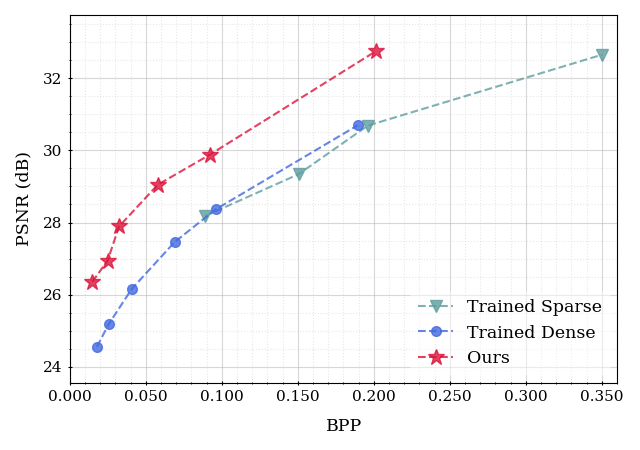
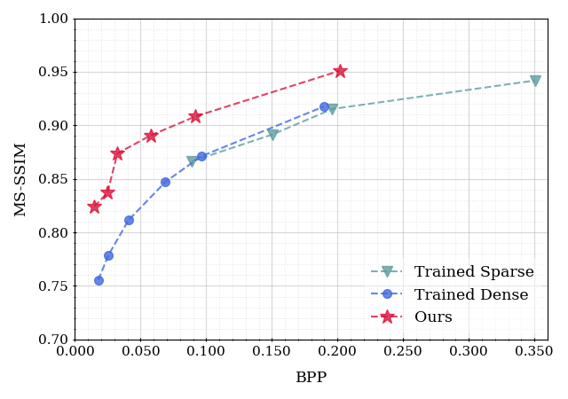

# A1-(Different Dataset) Cityscapes

In addition to results on UVG (Section 4) and Big Buck Bunny datasets (Appendix D), we further demonstrate the effectiveness of our framework on Cityscapes video*1, a widely used benchmark for urban scene understanding. We use one demo video sequence (stuttgart00) which consists of 599 frames with a resolution of 1024 × 2048. We consider two baseline models named “Trained Sparse" and “Trained Dense". The first one is fully trained sparse models obtained from a conventional model compression pipeline that consists of overfitting, pruning and finetuning steps. The other is fully trained dense networks (without pruning). We test video encoding quality of each method on multiple compression ratio setups. Below table shows that our method consistently achieves higher reconstruction (PSNR) and visual quality (MS-SSIM) than the baselines under similar compression ratios settings (BPP).

<table>
    <tr>
        <td align="center">
              <b>BPP - PSNR</b>
        </td>
        <td align="center">
              <b>BPP - MS-SSIM</b>
        </td>
    </tr>
</table>

 

<table>
    <thead>
        <tr class="header">
            <th colspan="3" style="text-align: center;">Trained Sparse</th>
            <th colspan="3" style="text-align: center;">Trained Dense</th>
            <th colspan="3" style="text-align: center;">Ours</th>
        </tr>
        <tr class="header">
            <th style="text-align: center">BPP</th>
            <th style="text-align: center">PSNR</th>
            <th style="text-align: center">MS-SSIM</th>
            <th style="text-align: center">BPP</th>
            <th style="text-align: center">PSNR</th>
            <th style="text-align: center">MS-SSIM</th>
            <th style="text-align: center">BPP</th>
            <th style="text-align: center">PSNR</th>
            <th style="text-align: center">MS-SSIM</th>
        </tr>
    </thead>
    <tbody>        
        <tr>
            <td style="text-align: center;">-</td>
            <td style="text-align: center;">-</td>
            <td style="text-align: center;">-</td>
            <td style="text-align: center;">0.026</td>
            <td style="text-align: center;">25.18</td>
            <td style="text-align: center;">0.779</td>
            <td style="text-align: center;">0.025</td>
            <td style="text-align: center;">26.94</td>
            <td style="text-align: center;">0.837</td>
        </tr>
        <tr>
            <td style="text-align: center;">0.089</td>
            <td style="text-align: center;">28.18</td>
            <td style="text-align: center;">0.866</td>
            <td style="text-align: center;">0.096</td>
            <td style="text-align: center;">28.37</td>
            <td style="text-align: center;">0.871</td>
            <td style="text-align: center;">0.092</td>
            <td style="text-align: center;">29.88</td>
            <td style="text-align: center;">0.908</td>
        </tr>
        <tr>
            <td style="text-align: center;">0.196</td>
            <td style="text-align: center;">30.69</td>
            <td style="text-align: center;">0.915</td>
            <td style="text-align: center;">0.189</td>
            <td style="text-align: center;">30.70</td>
            <td style="text-align: center;">0.917</td>
            <td style="text-align: center;">0.202</td>
            <td style="text-align: center;">32.76</td>
            <td style="text-align: center;">0.951</td>
        </tr>
    </tbody>
</table>

*1 Cordts, M., Omran, M., Ramos, S., Rehfeld, T., Enzweiler, M., Benenson, R., Franke, U., Roth, S., and Schiele, B. The cityscapes dataset for semantic urban scene understanding. In *Proceedings of the IEEE conference on computer vision and pattern recognition*, pp. 3213–3223, 2016.
